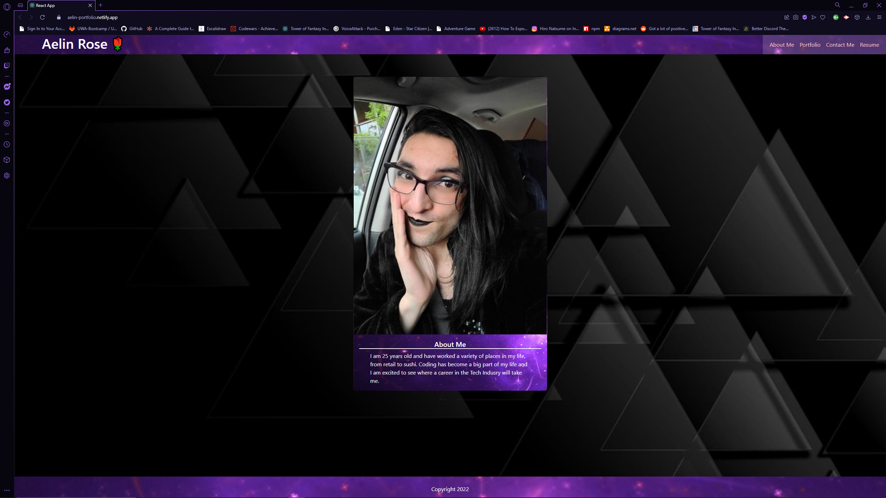
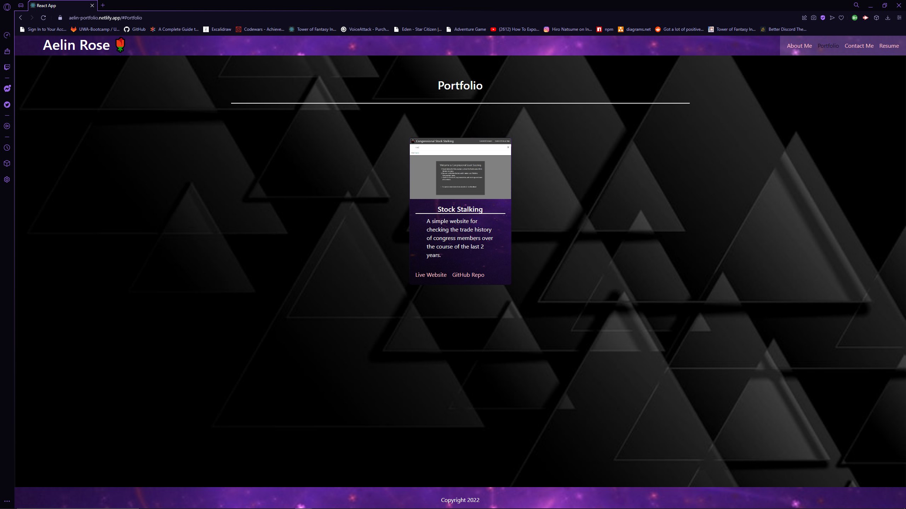

# My Portfolio #

## Description ##
React Framework Based Portfolio for my works

## Table of Contents ##
* [Description](#Description "Goto Description")
* [Installation](#installation "installation")
* [Usage Info](#Usage-Info "Usage-Info")
* [Images](#Images "Goto Images")
* [License](#License "Goto License")
* [Questions](#Questions "Goto Questions")

## Installation ##
Go to website by pasting - aelin-portfolio.netlify.app - into internet address bar

## Usage Info ##
- Visit website using above link
- Follow links and redirects to see my portfolio, contact info and my resume

## Images ##

## License ##
MIT

## Questions ##
Reach my GitHub Account, [deamonbunny](https://github.com/deamonbunny "My GitHub")
